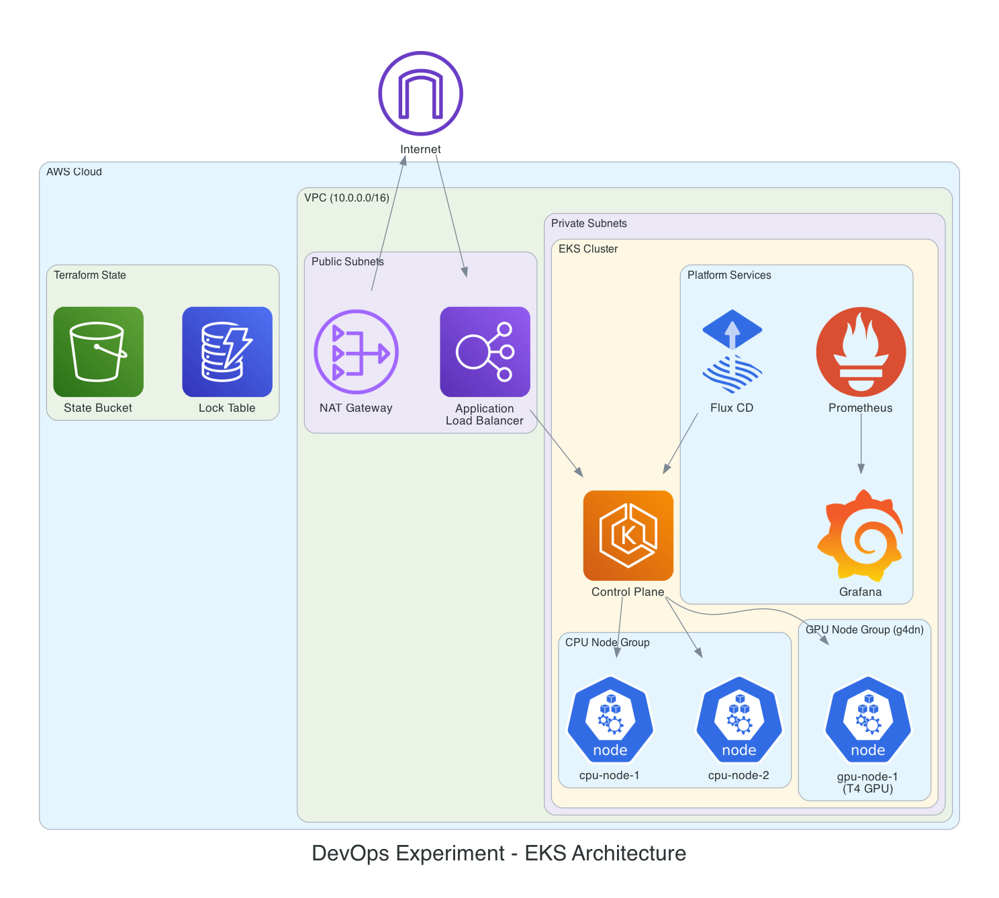
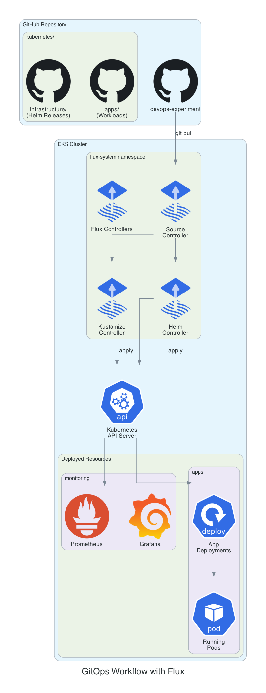

# Case Study: Kubernetes Production Platform Rebuild

## Overview

**Role:** DevOps Engineer
**Timeline:** [X months]
**Impact:** Reduced deployment time by X%, improved reliability from X% to 99.9%

## The Challenge

<!-- Customize this section with your actual experience -->

The existing Kubernetes infrastructure had grown organically and suffered from:
- Manual deployments causing inconsistencies across environments
- No standardized approach to infrastructure provisioning
- Limited observability into cluster health and application performance
- Scaling challenges during peak traffic periods
- Security vulnerabilities from outdated configurations

## Architecture

### Before vs After

**Before:** Manual kubectl deployments, single cluster with no IaC, no GitOps, limited monitoring.

**After:** Production-grade platform with full automation:

### GitOps Workflow

## Implementation

### Phase 1: Foundation (Week 1-2)
- Designed multi-environment Terraform module structure
- Implemented Terragrunt for DRY configuration across dev/staging/prod
- Set up remote state management with S3 and DynamoDB locking
- Created VPC with proper network segmentation

### Phase 2: Cluster Build (Week 3-4)
- Deployed EKS with managed node groups
- Configured cluster autoscaler for dynamic scaling
- Implemented IRSA for secure pod-level AWS access
- Set up private endpoint with bastion access

### Phase 3: GitOps & Platform Services (Week 5-6)
- Bootstrapped Flux CD for declarative deployments
- Deployed monitoring stack (Prometheus, Grafana, Alertmanager)
- Configured ingress with automatic TLS via cert-manager
- Implemented network policies for namespace isolation

### Phase 4: Migration & Validation (Week 7-8)
- Blue-green migration of workloads from old cluster
- Load testing to validate performance
- Runbook creation and team training
- Decommissioned legacy infrastructure

## Key Decisions

| Decision | Rationale |
|----------|-----------|
| EKS over self-managed | Reduced operational overhead, automatic control plane updates |
| Flux over ArgoCD | Lighter weight, better Helm support, pull-based security model |
| Terragrunt | DRY configuration, clear environment separation |
| Managed node groups | Simplified node lifecycle, automatic AMI updates |

## Results

<!-- Customize with your actual metrics -->

| Metric | Before | After | Improvement |
|--------|--------|-------|-------------|
| Deployment frequency | 1/week | 10/day | 70x |
| Lead time for changes | 2 weeks | 30 min | 96% reduction |
| MTTR | 4 hours | 15 min | 94% reduction |
| Failed deployments | 20% | 2% | 90% reduction |
| Infrastructure cost | $X/month | $Y/month | Z% reduction |

## Lessons Learned

1. **Start with observability** - Having metrics from day one made troubleshooting much easier
2. **Incremental migration** - Blue-green approach allowed rollback if issues arose
3. **Documentation is critical** - Runbooks prevented knowledge silos
4. **GitOps requires discipline** - All changes through PRs, no manual kubectl in prod

## Technologies Used

`Kubernetes` `EKS` `Terraform` `Terragrunt` `Flux CD` `Helm` `Prometheus` `Grafana` `GitHub Actions`
