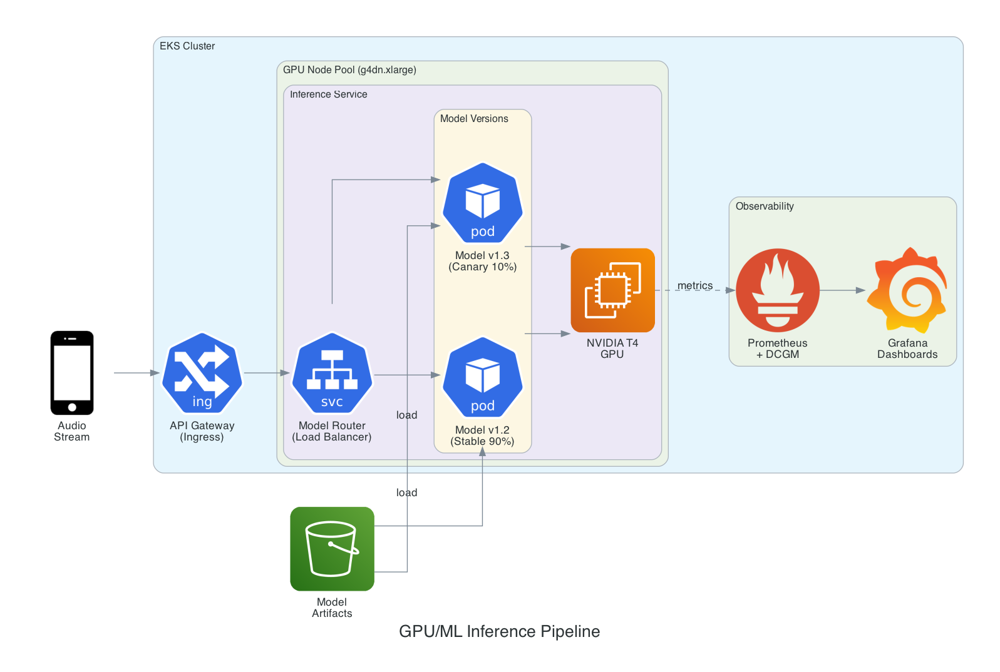

# Case Study: GPU/ML Inference Pipeline

## Overview

**Company:** Valital (Voice AI / Speech Analytics)
**Role:** DevOps Engineer
**Impact:** Enabled real-time voice analysis at scale with GPU-accelerated inference

## The Challenge

<!-- Customize with your actual Valital experience -->

Valital's voice AI platform required:
- Real-time speech-to-text transcription
- Low-latency inference for production voice analysis
- Cost-effective GPU utilization
- Seamless scaling during peak call volumes
- Model versioning and A/B testing capabilities

## Architecture

### ML Inference Pipeline



### GPU Resource Scheduling

```
┌────────────────────────────────────────────────────────────────┐
│                  GPU Node Scheduling Flow                       │
│                                                                │
│  Pod Request                     Node Selection                │
│  ┌─────────────────┐            ┌─────────────────┐           │
│  │ resources:      │            │ GPU Node Pool   │           │
│  │   limits:       │            │ ┌─────────────┐ │           │
│  │     nvidia.com/ │───────────▶│ │ g4dn.xlarge │ │           │
│  │       gpu: 1    │            │ │ T4 GPU      │ │           │
│  │   requests:     │            │ │ 16GB VRAM   │ │           │
│  │     memory: 8Gi │            │ └─────────────┘ │           │
│  └─────────────────┘            │ ┌─────────────┐ │           │
│                                 │ │ g4dn.2xlarge│ │           │
│  Tolerations:                   │ │ T4 GPU      │ │           │
│  ┌─────────────────┐            │ │ 32GB RAM    │ │           │
│  │ nvidia.com/gpu  │            │ └─────────────┘ │           │
│  │ NoSchedule      │            └─────────────────┘           │
│  └─────────────────┘                                          │
│                                                                │
│  Node Selector:                 NVIDIA Device Plugin           │
│  ┌─────────────────┐            ┌─────────────────┐           │
│  │ nvidia.com/gpu. │            │ Exposes GPUs as │           │
│  │ present: "true" │            │ schedulable     │           │
│  └─────────────────┘            │ resources       │           │
│                                 └─────────────────┘           │
└────────────────────────────────────────────────────────────────┘
```

## Implementation Details

### GPU Node Configuration

```yaml
# EKS Node Group Configuration
node_groups:
  gpu-inference:
    instance_types: ["g4dn.xlarge", "g4dn.2xlarge"]
    ami_type: AL2_x86_64_GPU
    capacity_type: ON_DEMAND  # Spot for batch, on-demand for real-time
    scaling_config:
      desired: 2
      min: 1
      max: 10
    labels:
      workload-type: gpu-inference
      nvidia.com/gpu.present: "true"
    taints:
      - key: nvidia.com/gpu
        value: "true"
        effect: NoSchedule
```

### Inference Service Deployment

```yaml
# Key configuration for GPU inference pods
spec:
  containers:
    - name: inference
      image: valital/speech-model:v1.2
      resources:
        requests:
          nvidia.com/gpu: 1
          memory: "8Gi"
          cpu: "4"
        limits:
          nvidia.com/gpu: 1
          memory: "16Gi"
          cpu: "8"
      env:
        - name: CUDA_VISIBLE_DEVICES
          value: "0"
        - name: TF_FORCE_GPU_ALLOW_GROWTH
          value: "true"
```

### Model Versioning Strategy

```
┌─────────────────────────────────────────────────────────┐
│              Model Deployment Strategy                   │
│                                                         │
│  ┌─────────────┐    ┌─────────────┐    ┌─────────────┐ │
│  │   Shadow    │    │   Canary    │    │   Stable    │ │
│  │   (0%)      │    │   (10%)     │    │   (90%)     │ │
│  │             │    │             │    │             │ │
│  │  New model  │    │  New model  │    │ Prod model  │ │
│  │  testing    │    │  validation │    │             │ │
│  └─────────────┘    └─────────────┘    └─────────────┘ │
│         │                  │                  │        │
│         ▼                  ▼                  ▼        │
│  ┌─────────────────────────────────────────────────┐   │
│  │            Traffic Splitting (Istio)            │   │
│  └─────────────────────────────────────────────────┘   │
└─────────────────────────────────────────────────────────┘
```

## Key Optimizations

### 1. GPU Memory Management
- Implemented TensorFlow memory growth to prevent OOM
- Used model quantization (FP16) for 2x throughput improvement
- Batch inference requests for better GPU utilization

### 2. Autoscaling Strategy
```yaml
# Custom metrics-based autoscaling
apiVersion: autoscaling/v2
kind: HorizontalPodAutoscaler
spec:
  metrics:
    - type: External
      external:
        metric:
          name: inference_queue_depth
        target:
          type: AverageValue
          averageValue: "10"
    - type: Pods
      pods:
        metric:
          name: gpu_utilization
        target:
          type: AverageValue
          averageValue: "70"
```

### 3. Cost Optimization
- Spot instances for batch processing (70% cost reduction)
- GPU time-slicing for dev/staging environments
- Cluster autoscaler with scale-to-zero for off-peak hours

## Results

| Metric | Before | After | Improvement |
|--------|--------|-------|-------------|
| P99 Latency | 500ms | 120ms | 76% reduction |
| Throughput | 100 req/s | 500 req/s | 5x increase |
| GPU Utilization | 30% | 75% | 2.5x improvement |
| Cost per inference | $0.01 | $0.003 | 70% reduction |
| Model deployment time | 2 hours | 15 min | 87% reduction |

## Monitoring & Alerting

### GPU Metrics Dashboard
- GPU utilization per pod
- VRAM usage and availability
- Inference latency percentiles
- Queue depth and throughput
- Model accuracy metrics (A/B comparison)

### Key Alerts
```yaml
# Example Prometheus alert
- alert: HighGPUMemoryUsage
  expr: DCGM_FI_DEV_FB_USED / DCGM_FI_DEV_FB_TOTAL > 0.9
  for: 5m
  labels:
    severity: warning
  annotations:
    summary: GPU memory usage above 90%
```

## Technologies Used

`NVIDIA GPUs (T4/A10G)` `CUDA` `TensorFlow Serving` `Kubernetes` `EKS` `Prometheus` `DCGM Exporter` `Istio` `HPA`
